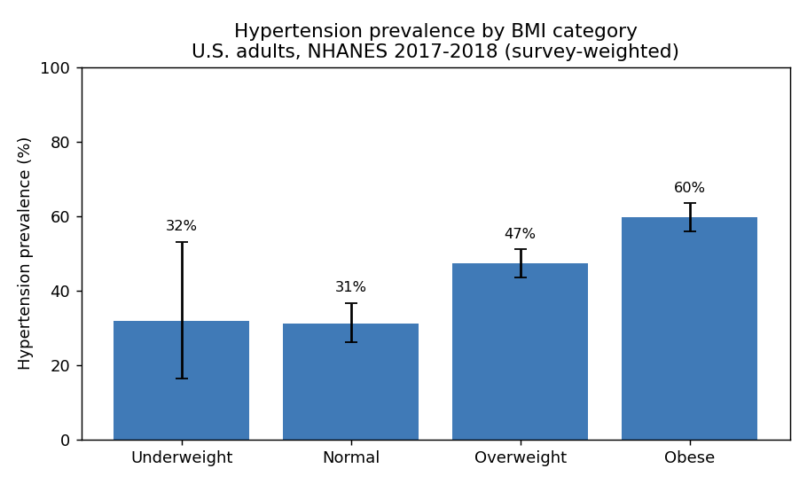
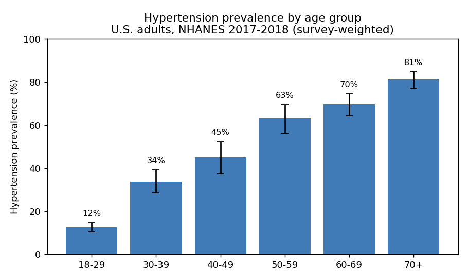

# Hypertension and obesity among U.S. adults: a survey-weighted analysis of NHANES 2017–2018

*Reproducible analysis. All figures and numbers below are produced by
`src/analysis.py` from the public CDC data files.*

## Summary

Using the 2017–2018 National Health and Nutrition Examination Survey (NHANES),
hypertension — defined by the 2017 ACC/AHA threshold (≥130/80 mmHg) or current
antihypertensive medication — affected an estimated **47.9% (95% CI 44.9–51.0)**
of U.S. adults, representing roughly **236 million people**. Prevalence rose
steadily with both BMI and age. After adjustment for age and sex, obesity was
associated with **2.68 times the odds** of hypertension (95% CI 2.33–3.08).

## Methods

**Data.** NHANES 2017–2018 public files: demographics (`DEMO_J`), blood-pressure
examination (`BPX_J`), body measures (`BMX_J`), and the blood-pressure
questionnaire (`BPQ_J`), merged on the respondent ID (`SEQN`).

**Measures.** Systolic and diastolic blood pressure were each averaged over the
up-to-three measured readings (diastolic values of 0, a device artefact, were
treated as missing). Hypertension was defined as mean SBP ≥ 130 **or** mean
DBP ≥ 80 **or** currently taking antihypertensive medication. Obesity was
BMI ≥ 30 kg/m².

**Sample.** Adults aged ≥ 18 with a positive MEC examination weight and
non-missing blood-pressure and BMI information (n = **5,238**). Respondents
without the information needed to classify the outcome or exposure were excluded
rather than misclassified.

**Estimation.** All estimates use the MEC examination weights (`WTMEC2YR`).
Prevalence and its 95% confidence intervals were computed with Taylor
linearization accounting for the survey strata (`SDMVSTRA`) and primary sampling
units (`SDMVPSU`). Adjusted odds ratios came from a weighted logistic regression
of hypertension on obesity, age (per decade), and sex; confidence intervals were
obtained from a **design-based bootstrap** (400 replicates) that resamples PSUs
with replacement within strata and refits the weighted model on each replicate.

## Results

**Overall.** Weighted hypertension prevalence was 47.9% (95% CI 44.9–51.0).

**By BMI category.** Prevalence increased across BMI categories:

| BMI category | Hypertension prevalence |
|---|---|
| Normal | 31% |
| Overweight | 47% |
| Obese | 60% |

**By age.** A strong age gradient, from 12.5% at 18–29 to 81.1% at 70+:

| Age group | Prevalence (95% CI) |
|---|---|
| 18–29 | 12.5 (10.5–14.7) |
| 30–39 | 33.7 (28.4–39.3) |
| 40–49 | 44.8 (37.4–52.4) |
| 50–59 | 62.9 (55.8–69.5) |
| 60–69 | 69.6 (64.1–74.5) |
| 70+ | 81.1 (76.8–84.8) |

**By sex.** Crude prevalence was higher in men (52.7%, 49.1–56.4) than women
(43.4%, 40.0–46.9).

**Adjusted associations.**

| Term | Adjusted OR (95% CI) |
|---|---|
| Obesity (BMI ≥ 30) | **2.68 (2.33–3.08)** |
| Age (per 10 years) | 1.95 (1.90–2.00) |
| Female | 0.54 (0.47–0.62) |

Obesity roughly **2.7×** the odds of hypertension independent of age and sex;
each additional decade of age nearly **doubled** the odds; and after adjusting
for age and the body-composition difference, women had lower odds than men —
consistent with the crude pattern being partly confounded by age structure.

## Discussion

These results reproduce well-established epidemiology: a high adult hypertension
burden under the 2017 guideline (~45–48% in published NHANES analyses), a clear
BMI dose-response, and a steep age gradient. The value of this repository is
**methodological correctness and reproducibility** — correct survey weighting,
design-based variance, and careful missing-data handling — rather than a novel
finding.

## Limitations

- **Cross-sectional**: associations are not causal; hypertension and obesity are
  measured at the same time.
- **Blood pressure** is from a single examination visit; a clinical diagnosis
  requires readings on separate occasions, so prevalence here is an
  epidemiological estimate, not a count of diagnoses.
- **Medication** status is self-reported.
- **Single cycle** (2017–2018); pooling adjacent cycles would tighten intervals
  and is a natural extension.

## Reproducibility

`python src/fetch_data.py && python src/analysis.py` regenerates every number,
table, and figure in this report from the public source files. Data are
CDC/NCHS, public domain.
